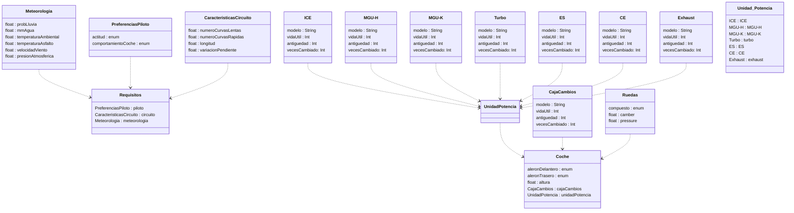

### domain schema

```mermaid
classDiagram
  class Requisitos {
    PreferenciasPiloto : piloto
    CaracteristicasCircuito : circuito
    Meteorologia : meteorologia
  }
  class Meteorologia {
    float : probLluvia
    float : mmAgua
    float : temperaturaAmbiental
    float : temperaturaAsfalto
    float : velocidadViento
    float : presionAtmosferica
  }
  class PreferenciasPiloto {
    actitud : enum
    comportamientoCoche : enum
  }
  class CaracteristicasCircuito {
    float : numeroCurvasLentas
    float : numeroCurvasRapidas
    float : longitud
    float : variacionPendiente
  }
  class ICE {
    modelo : String
    vidaUtil : Int
    antiguedad : Int
    vecesCambiado: Int
  }
  class MGU-H {
    modelo : String
    vidaUtil : Int
    antiguedad : Int
    vecesCambiado: Int
  }
  class MGU-K {
    modelo : String
    vidaUtil : Int
    antiguedad : Int
    vecesCambiado: Int
  }
  class Turbo {
    modelo : String
    vidaUtil : Int
    antiguedad : Int
    vecesCambiado: Int
  }
  class ES {
    modelo : String
    vidaUtil : Int
    antiguedad : Int
    vecesCambiado: Int
  }
  class CE {
    modelo : String
    vidaUtil : Int
    antiguedad : Int
    vecesCambiado: Int
  }
  class Exhaust {
    modelo : String
    vidaUtil : Int
    antiguedad : Int
    vecesCambiado: Int
  }
  class CajaCambios {
    modelo : String
    vidaUtil : Int
    antiguedad : Int
    vecesCambiado : Int
  }
  class Unidad_Potencia {
    ICE : ICE
    MGU-H : MGU-H
    MGU-K : MGU-K
    Turbo : turbo
    ES : ES
    CE : CE
    Exhaust : exhaust
  }
  class Ruedas {
    compuesto : enum
    float : camber
    float : pressure
  }
  class Coche {
    aleronDelantero : enum
    aleronTrasero : enum
    float : altura
    CajaCambios : cajaCambios
    UnidadPotencia : unidadPotencia
   }
  UnidadPotencia ..> Coche
  CajaCambios ..> Coche
  Ruedas ..> Coche
  ICE ..> UnidadPotencia
  MGU-H ..> UnidadPotencia
  MGU-K ..> UnidadPotencia
  Turbo ..> UnidadPotencia
  ES ..> UnidadPotencia
  CE ..> UnidadPotencia
  Exhaust ..> UnidadPotencia
  Meteorologia ..> Requisitos
  PreferenciasPiloto ..> Requisitos
  CaracteristicasCircuito ..> Requisitos
```
