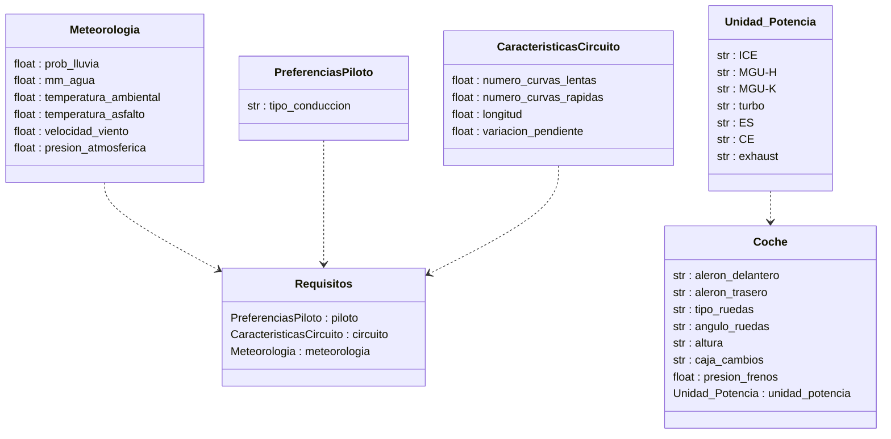

### domain schema

```mermaid
classDiagram
  class Requisitos {
    PreferenciasPiloto : piloto
    CaracteristicasCircuito : circuito
    Meteorologia : meteorologia
  }
  class Meteorologia {
    float : prob_lluvia
    float : mm_agua
    float : temperatura_ambiental
    float : temperatura_asfalto
    float : velocidad_viento
    float : presion_atmosferica
  }
  class PreferenciasPiloto {
    str : tipo_conduccion
  }

  class CaracteristicasCircuito {
    float : numero_curvas_lentas
    float : numero_curvas_rapidas
    float : longitud
    float : variacion_pendiente
  }
  
  Meteorologia ..> Requisitos
  PreferenciasPiloto ..> Requisitos
  CaracteristicasCircuito ..> Requisitos
  
  class Unidad_Potencia {
    str : ICE
    str : MGU-H
    str : MGU-K
    str : turbo
    str : ES
    str : CE
    str : exhaust
  }
  
  class Coche {
    str : aleron_delantero
    str : aleron_trasero
    str : tipo_ruedas
    str : angulo_ruedas
    str : altura
    str : caja_cambios
    float : presion_frenos
    Unidad_Potencia : unidad_potencia
  }
  
  Unidad_Potencia ..> Coche
```
