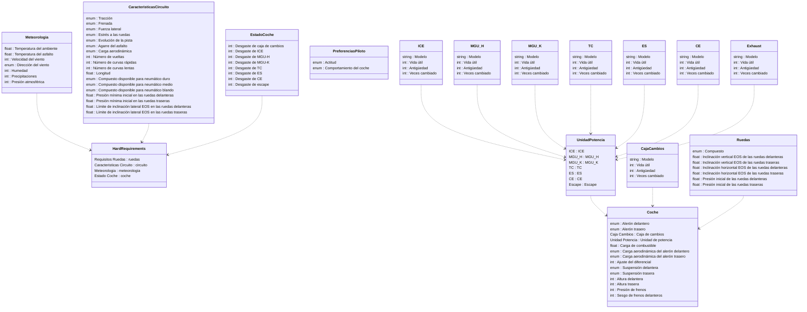

### domain schema

```mermaid
classDiagram
  class Hard Requirements {
    Requisitos Ruedas         : ruedas
    Caracteristicas Circuito  : circuito
    Meteorologia              : meteorologia
    Estado Coche              : coche
  }

  class Meteorologia {
    float : Temperatura del ambiente
    float : Temperatura del asfalto
    int   : Velocidad del viento
    enum  : Dirección del viento
    int   : Humedad
    int   : Precipitaciones
    int   : Presión atmosférica
  }

  class Caracteristicas Circuito {
    enum  : Tracción
    enum  : Frenada
    enum  : Fuerza lateral
    enum  : Estrés a las ruedas
    enum  : Evolución de la pista
    enum  : Agarre del asfalto
    enum  : Carga aerodinámica
    int   : Número de vueltas
    int   : Número de curvas rápidas
    int   : Número de curvas lentas
    float : Longitud
    enum  : Compuesto disponible para neumático duro
    enum  : Compuesto disponible para neumático medio
    enum  : Compuesto disponible para neumático blando
    float : Presión mínima inicial en las ruedas delanteras
    float : Presión mínima inicial en las ruedas traseras
    float : Límite de inclinación lateral EOS en las ruedas delanteras
    float : Límite de inclinación lateral EOS en las ruedas traseras
  }
  
  class Estado Coche {
    int : Desgaste de caja de cambios
    int : Desgaste de ICE
    int : Desgaste de MGU-H
    int : Desgaste de MGU-K
    int : Desgaste de TC
    int : Desgaste de ES
    int : Desgaste de CE
    int : Desgaste de escape
  }
  
  class PreferenciasPiloto {
    enum : Actitud
    enum : Comportamiento del coche
  }

  class ICE {
    string : Modelo
    int    : Vida útil
    int    : Antigüedad
    int    : Veces cambiado
  }

  class MGU_H {
    string : Modelo
    int    : Vida útil
    int    : Antigüedad
    int    : Veces cambiado
  }

  class MGU_K {
    string : Modelo
    int    : Vida útil
    int    : Antigüedad
    int    : Veces cambiado
  }

  class ES {
    string : Modelo
    int    : Vida útil
    int    : Antigüedad
    int    : Veces cambiado
  }

  class CE {
    string : Modelo
    int    : Vida útil
    int    : Antigüedad
    int    : Veces cambiado
  }

  class Exhaust {
    string : Modelo
    int    : Vida útil
    int    : Antigüedad
    int    : Veces cambiado
  }

  class TC {
    string : Modelo
    int    : Vida útil
    int    : Antigüedad
    int    : Veces cambiado
  }

  class Caja Cambios {
    string : Modelo
    int    : Vida útil
    int    : Antigüedad
    int    : Veces cambiado
  }
  
  class Unidad Potencia {
    ICE     : ICE
    MGU_H   : MGU_H
    MGU_K   : MGU_K
    TC      : TC
    ES      : ES
    CE      : CE
    Escape  : Escape
  }

  class Ruedas {
    enum  : Compuesto
    float : Inclinación vertical EOS de las ruedas delanteras
    float : Inclinación vertical EOS de las ruedas traseras
    float : Inclinación horizontal EOS de las ruedas delanteras
    float : Inclinación horizontal EOS de las ruedas traseras
    float : Presión inicial de las ruedas delanteras
    float : Presión inicial de las ruedas traseras
  }
  
  class Coche {
    enum : Alerón delantero
    enum : Alerón trasero
    Caja Cambios : Caja de cambios
    Unidad Potencia : Unidad de potencia
    float : Carga de combustible
    enum : Carga aerodinámica del alerón delantero
    enum : Carga aerodinámica del alerón trasero
    int : Ajuste del diferencial
    enum : Suspensión delantera
    enum : Suspensión trasera
    int : Altura delantera
    int : Altura trasera
    int : Presión de frenos
    int : Sesgo de frenos delanteros
   }
  
  Unidad Potencia ..> Coche
  Caja Cambios ..> Coche
  Ruedas ..> Coche

  ICE ..> UnidadPotencia
  MGU_H ..> UnidadPotencia
  MGU_K ..> UnidadPotencia
  TC ..> UnidadPotencia
  ES ..> UnidadPotencia
  CE ..> UnidadPotencia
  Exhaust ..> UnidadPotencia

  Meteorologia ..> Hard Requirements
  Caracteristicas Circuito ..> Hard Requirements
  Estado Coche ..> Hard Requirements
```
