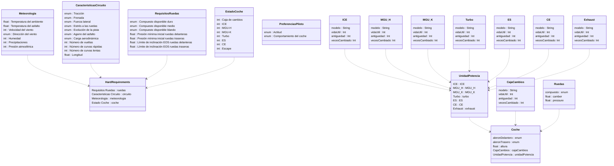

### domain schema

```mermaid
classDiagram
  class Hard Requirements {
    Requisitos Ruedas         : ruedas
    Caracteristicas Circuito  : circuito
    Meteorologia              : meteorologia
    Estado Coche              : coche
  }

  class Meteorologia {
    float : Temperatura del ambiente
    float : Temperatura del asfalto
    int   : Velocidad del viento
    enum  : Dirección del viento
    int   : Humedad
    int   : Precipitaciones
    int   : Presión atmosférica
  }

  class Caracteristicas Circuito {
    enum  : Tracción
    enum  : Frenada
    enum  : Fuerza lateral
    enum  : Estrés a las ruedas
    enum  : Evolución de la pista
    enum  : Agarre del asfalto
    enum  : Carga aerodinámica
    int   : Número de vueltas
    int   : Número de curvas rápidas
    int   : Número de curvas lentas
    float : Longitud
  }
  
  class Requisitos Ruedas {
    enum  : Compuesto disponible duro
    enum  : Compuesto disponible medio
    enum  : Compuesto disponible blando
    float : Presión mínima inicial ruedas delanteras
    float : Presión mínima inicial ruedas traseras
    float : Límite de inclinación EOS ruedas delanteras
    float : Límite de inclinación EOS ruedas traseras
  }
  
  class Estado Coche {
    int : Caja de cambios
    int : ICE
    int : MGU-H
    int : MGU-K
    int : Turbo
    int : ES
    int : CE
    int : Escape
  }
  
  class PreferenciasPiloto {
    enum : Actitud
    enum : Comportamiento del coche
  }

  class ICE {
    modelo : String
    vidaUtil : Int
    antiguedad : Int
    vecesCambiado: Int
  }

  class MGU_H {
    modelo : String
    vidaUtil : Int
    antiguedad : Int
    vecesCambiado: Int
  }

  class MGU_K {
    modelo : String
    vidaUtil : Int
    antiguedad : Int
    vecesCambiado: Int
  }

  class ES {
    modelo : String
    vidaUtil : Int
    antiguedad : Int
    vecesCambiado: Int
  }

  class CE {
    modelo : String
    vidaUtil : Int
    antiguedad : Int
    vecesCambiado: Int
  }

  class Exhaust {
    modelo : String
    vidaUtil : Int
    antiguedad : Int
    vecesCambiado: Int
  }

  class Turbo {
    modelo : String
    vidaUtil : Int
    antiguedad : Int
    vecesCambiado: Int
  }

  class CajaCambios {
    modelo : String
    vidaUtil : Int
    antiguedad : Int
    vecesCambiado : Int
  }
  
  class UnidadPotencia {
    ICE : ICE
    MGU_H : MGU_H
    MGU_K : MGU_K
    Turbo : turbo
    ES : ES
    CE : CE
    Exhaust : exhaust
  }

  class Ruedas {
    compuesto : enum
    float : camber
    float : pressure
  }
  
  class Coche {
    aleronDelantero : enum
    aleronTrasero : enum
    float : altura
    CajaCambios : cajaCambios
    UnidadPotencia : unidadPotencia
   }
  
  UnidadPotencia ..> Coche
  CajaCambios ..> Coche
  Ruedas ..> Coche

  ICE ..> UnidadPotencia
  MGU_H ..> UnidadPotencia
  MGU_K ..> UnidadPotencia
  Turbo ..> UnidadPotencia
  ES ..> UnidadPotencia
  CE ..> UnidadPotencia
  Exhaust ..> UnidadPotencia

  Meteorologia ..> Hard Requirements
  Caracteristicas Circuito ..> Hard Requirements
  Requisitos Ruedas ..> Hard Requirements
  Estado Coche ..> Hard Requirements
```
